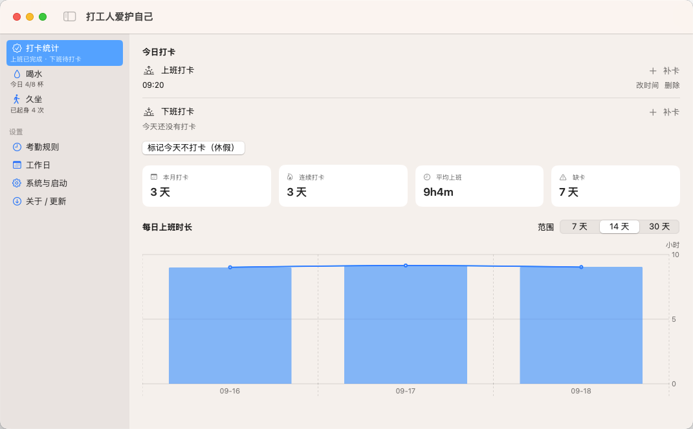
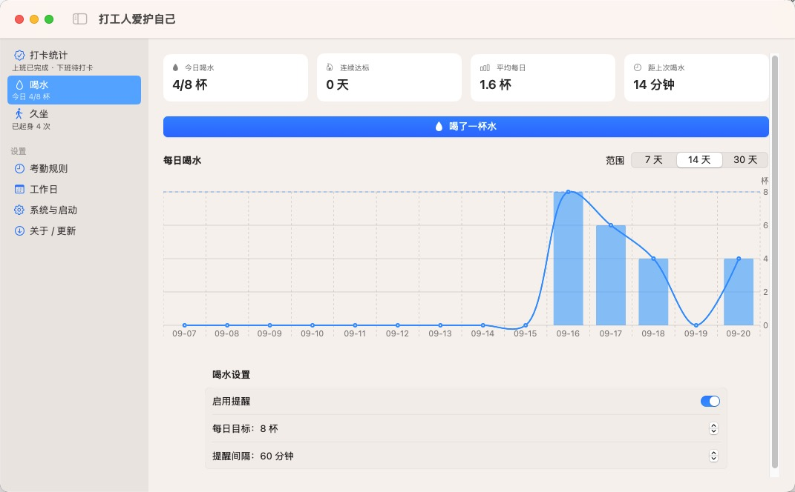

[](https://github.com/iamxz/PunchClock/actions/workflows/ci.yml)
[](https://github.com/iamxz/PunchClock/releases)
[](https://opensource.org/licenses/MIT)

# Daka

一个常规 macOS 本地打卡提醒应用（Dock 图标 + 主窗口 + 菜单栏项），在工作日提醒你完成 **上班 / 下班** 两次打卡。

打卡记录**纯本地保存**：不连接任何公司考勤系统、不访问网络、不打开网页、不执行外部脚本。

## 预览

| 打卡统计 | 喝水 / 健康 |
| --- | --- |
|  |  |

## 功能特性

- **考勤规则驱动 + 全屏强提醒**：进入上班时间即弹出全屏遮罩（置顶、拦截退出快捷键），按可配置间隔（默认 2 分钟，1–60 分钟）重复重弹，直到完成对应打卡才停止。下班提醒时间随上班卡浮动：早到按上班时间算，晚打顺延。
- **考勤参数**：上班时间 / 工作时长 / 弹性时间三参数配置（可在「设置 → 考勤规则」修改）。
- **默认时间**：上班时间 09:00，工作时长 9 小时，弹性 30 分钟。
- **工作日判断**：基于标准日历，默认周一至周五，并内置 2025–2026 年中国法定节假日与调休数据（节假日自动休息、调休日自动补班）。
- **今天不打卡（休假）**：一键跳过当天，跨天自动恢复。
- **开机自启**：登录时若当天上班未打卡，会立即催打卡。
- **定点拉起**：通过 `launchd` 在三个打卡时点自动拉起已在后台退出的应用（单实例）；已在运行时则跳过（不重复拉起、不弹主窗口）。
- **系统事件响应**：休眠唤醒、系统时间/时区变更后立即重算提醒。
- **数据容错**：写盘原子替换；JSON 损坏时自动备份并重建，菜单栏可见错误。
- **打卡统计**：主窗口「统计」页展示四张指标卡（本月打卡 / 连续打卡 / 平均上班 / 缺卡）与最近 7 / 14 / 30 天每日上班时长柱状图。
- **喝水 / 走动**：到点同样以全屏强提示提醒你喝水、起身活动，可一键记录一杯水 / 一次起身。提醒只在工作日、打卡工作时段内生效。
- **健康统计**：控制中心「喝水」「久坐」页展示今日进度、连续达标、平均每日与 7 / 14 / 30 天柱状图（含目标线）。

## 系统要求

- macOS 14 (Sonoma) 或更高版本
- Swift 5.10+（随 Xcode 15.3+ / Command Line Tools 提供）

## 构建与安装

```sh
make build     # 仅编译（release，本机架构）
make test      # 运行单元测试
make icon      # 由 Resources/AppIcon.iconset 生成 Daka.icns
make app       # 编译 + 组装并 ad-hoc 签名 build/Daka.app（本机架构）
make pkg       # 编译 Universal（arm64 + x86_64）+ 组装 + 打成 build/Daka-<版本>.pkg
make install   # 在 app 基础上安装到 /Applications/Daka.app
make clean     # 清理 .build 与 build
```

首次运行若需重新生成图标，先执行 `make icon`；`make app` / `make pkg` / `make install` 依赖 `Resources/Daka.icns` 已存在。

### 下载安装

从 [GitHub Releases](https://github.com/iamxz/PunchClock/releases) 下载最新版本的 `.pkg` 安装包。

校验包完整性：

```sh
shasum -a 256 -c checksums.txt
```

### 自动发版

改 `Resources/Info.plist` 的 `CFBundleShortVersionString`（三段 `X.Y.Z`）并推到 `main`：CI 通过后自动打 `vX.Y.Z` 标签并发布 `.pkg` + `.app.zip` + `checksums.txt`。

### 分发安装包

`make pkg` 产出的 `build/Daka-<版本>.pkg` 是 Universal 安装包，双击后自动把应用装到 `/Applications/Daka.app`。

app 为 **ad-hoc 签名**、安装包本身**未签名**，且均**未公证**，别人首次打开会被 Gatekeeper 拦截，需任选一种放行：

- 右键 pkg →「打开」，或
- 系统设置 →「隐私与安全性」→「仍要打开」。

若安装后启动仍提示已损坏/无法验证，可尝试：

```sh
xattr -dr com.apple.quarantine /Applications/Daka.app
```

**安装前请先退出正在运行的应用**（主窗口「设置 → 系统与启动 → 退出应用」），否则安装器覆盖运行中的 app 可能失败。

## 使用说明

启动后应用同时出现在 Dock 与菜单栏，并打开主窗口：

- 主窗口左侧为工具列表 +「设置」分组；「设置」下分「考勤规则 / 系统与启动」两个子页分别配置，「打卡统计」页可切换「今天不打卡」。
- 「打卡统计」页顶部为「今日打卡」：可对上班/下班**补卡**（选时间）、**改时间**、**删除**误点记录，仅限今天。
- **关闭主窗口不退出应用**，应用继续在后台提醒；再次点 Dock 图标或菜单栏面板右上角的「控制中心」图标可重新打开。
- 菜单栏图标两态：`checkmark.seal` 正常 / `exclamationmark.triangle.fill` 有待打卡。
- 菜单栏面板：右上角「控制中心」图标（`switch.2`）+ 今日状态 + 打卡按钮。
- **应用不能随便退出**：菜单栏 / 控制中心都没有退出入口，Cmd+Q 与 Dock 退出同样被拦截，请让它在后台常驻持续提醒。
- **需要退出时**：主窗口「设置 → 系统与启动 → 退出应用」，二次确认后才退出。
- **系统注销 / 关机 / 重启**时允许应用退出，不会阻碍关机。
- 全屏遮罩可用 **ESC 暂停**：立即隐藏，过「重复提醒」间隔后自动重新弹出，直到完成打卡或健康动作；Cmd+W / Cmd+M / Cmd+H 仍无效。
- 打卡后若当天仍未完成（如下班未满最少工时或缺少上班卡），遮罩会显示原因与还差多久。
- 喝水 / 走动到点同样弹出全屏强提示（含「已喝水」「已起身」按钮），打卡与健康提醒可同一全屏同时出现，处理完一样即自动收起对应部分。

## 数据存储

记录保存在：

```
~/Library/Application Support/Daka/data.json
```

结构大致为：

```jsonc
{
  "settings": {
    "enabled": true,
    "workdays": [2, 3, 4, 5, 6],          // 2=周一 … 6=周五（基础工作日，法定节假日/调休另行覆盖）
    "workStartTime": "09:00",
    "workDurationHours": 9,
    "flexMinutes": 30,
    "reminderIntervalSeconds": 120
  },
  "records": {
    "2026-09-14": {
      "morningPunches": ["2026-09-14T09:01:12+08:00"],
      "eveningPunches": [],
      "skipped": false
    }
  }
}
```

`records` 以 `yyyy-MM-dd` 为键保留全部历史。文件损坏时会重命名为 `data.json.corrupt-<时间戳>-*` 备份，并重建空存储。

健康习惯记录单独保存在 `~/Library/Application Support/Daka/health.json`，结构如下：

```jsonc
{
  "settings": {
    "waterEnabled": true,
    "waterGoalCups": 8,
    "waterIntervalMinutes": 60,
    "movementEnabled": true,
    "movementGoalCount": 8,
    "movementIntervalMinutes": 60
  },
  "records": {
    "2026-09-14": {
      "drinks": ["2026-09-14T09:12:00+08:00"],
      "stands": ["2026-09-14T10:30:00+08:00"]
    }
  }
}
```

损坏时同样备份为 `health.json.corrupt-<时间戳>-*` 并重建。

## 项目结构

```
Sources/
  DakaCore/        # 纯逻辑，无 UI/IO 依赖，可单测
    Models.swift          数据模型（Settings / DayRecord）
    AttendanceRule.swift  纯函数：由考勤参数推导有效上班 / 应下班 / 完成判定
    ScheduleEvaluator.swift 纯函数：计算待打卡任务
    Scheduler.swift       定时 tick，驱动提醒
    PunchStore.swift      持久化（原子写、损坏恢复）
    DakaClock.swift       可注入时钟
    Statistics.swift      统计口径
    PunchFeedback.swift   打卡未完成原因文案
    DakaDate.swift / PunchTarget.swift / ToolCatalog.swift 日期、打卡目标与工具目录
    HealthModels.swift / HealthRules.swift / HealthStore.swift / HealthStatistics.swift 健康习惯
    LaunchAgentPlist.swift 定点拉起 plist 生成
  Daka/            # AppKit + SwiftUI 应用层
    AppDelegate.swift / DakaApp.swift
    AppModel.swift / MenuBarView.swift / ControlCenterView.swift
    MainWindowController.swift / SettingsPage.swift / SettingsPages.swift
    StatisticsView.swift / PunchToolView.swift / PunchButton.swift
    ReminderController.swift / OverlayView.swift
    HealthReminderController.swift / HealthToolViews.swift
    LoginItemManager.swift / ScheduledLaunchManager.swift
Tests/DakaCoreTests/   # 单元测试
Resources/             # Info.plist、Daka.icns 应用图标、状态栏图标
scripts/               # 图标生成脚本（make-appicon.swift 等）
docs/                  # 设计文档、实现计划、验证清单
```

## 测试

```sh
make test
# 或
swift test
```

测试覆盖 `ScheduleEvaluator`（时间窗口/全屏强提醒/工作日/休假/开机强制）、`PunchStore`（往返、损坏恢复、跨天）、`Statistics` 等核心逻辑，均使用注入时钟，不依赖真实时间。

## 已知限制

- macOS 不允许普通应用完全锁死系统：**强制退出（Cmd+Opt+Esc / `kill -9`）无法被屏蔽**。日常退出入口（菜单/Cmd+Q/Dock）全部拦截，但强制退出无法阻止；系统注销/关机/重启放行。
- 系统注销/关机开始时放行退出；若注销被取消，放行状态最多 60 秒后自动恢复封锁（因此极慢的关机流程理论上可能被短暂拦截，属已知边界）。
- 不做节假日日历，仅按星期判断，提供手动「今天不打卡」。
- 定点拉起依赖 `launchd`，需要用户已登录且系统已唤醒；到点拉起在后台运行，不会弹出主窗口（已在运行时则跳过，不重复拉起、不弹主窗口）。
- app 为 ad-hoc 签名、安装包未签名，且均未公证（无 Developer ID 证书）；分发给他人需按「分发安装包」一节放行 Gatekeeper。

## 参与贡献

我们欢迎各种形式的贡献！请查看 [CONTRIBUTING.md](CONTRIBUTING.md) 了解详情。
